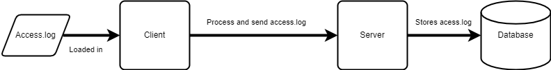

# TCP Log Transfer



This project objective is to have two applications (client and server).

The client application will load a .log file, process it and send to the server application via TCP connection. The server will receive the processed data and store it on the database.

Access.log is not stored in this repo because it contains 500mb of data. The log follows the Common Log Format (CLF) structure and looks like this:

```
00.00.000.0 - - [19/Dec/2020:13:57:26 +0100] "GET /index.php?id=100 HTTP/1.1" 200 32653 "-" "Mozilla/5.0 (compatible; bingbot/2.0; +http://www.bing.com/bingbot.htm)" "-"
```

CLF line syntax:

```
host ident authuser date request status bytes
```